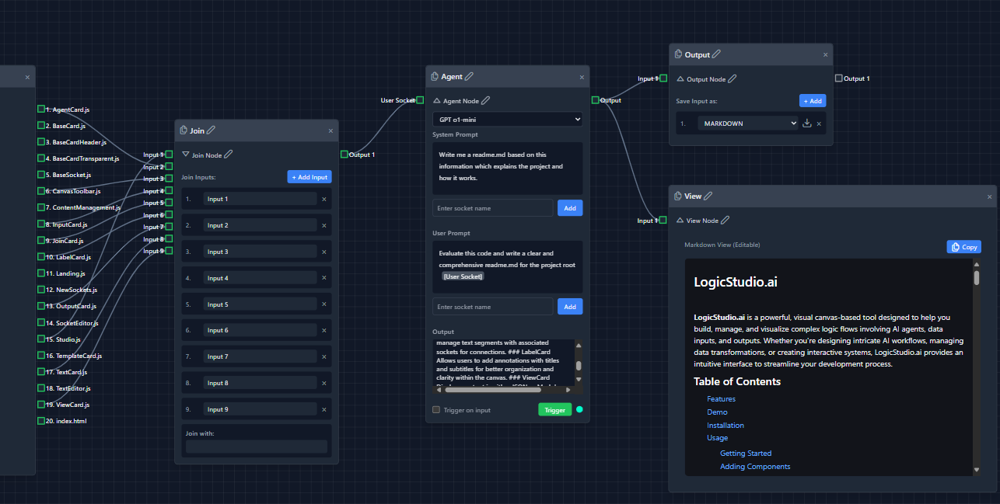

# LogicStudio.ai

**LogicStudio.ai** is a powerful, visual canvas-based tool designed to help you build, manage, and visualize complex logic flows involving AI agents, data inputs, and outputs. Whether you're designing intricate AI workflows, managing data transformations, or creating interactive systems, LogicStudio.ai provides an intuitive interface to streamline your development process.

## Table of Contents

- [Features](#features)
- [Demo](#demo)
- [Installation](#installation)
- [Usage](#usage)
  - [Getting Started](#getting-started)
  - [Adding Components](#adding-components)
  - [Connecting Components](#connecting-components)
  - [Configuring Components](#configuring-components)
  - [Canvas Management](#canvas-management)
  - [Importing & Exporting](#importing--exporting)
- [Components Overview](#components-overview)
  - [Studio](#studio)
  - [CanvasToolbar](#canvastoolbar)
  - [AgentCard](#agentcard)
  - [InputCard](#inputcard)
  - [OutputCard](#outputcard)
  - [JoinCard](#joincard)
  - [TextCard](#textcard)
  - [LabelCard](#labelcard)
  - [ViewCard](#viewcard)
- [Technologies Used](#technologies-used)
- [Contributing](#contributing)
- [License](#license)

## Features


- **This readme.md was created using LogicStudio.ai**

- **Visual Canvas:** Drag-and-drop interface to design your logic flows effortlessly.
- **Dynamic Components:** A variety of components (cards) like Agents, Inputs, Outputs, Joins, Texts, Labels, and Views to construct complex workflows.
- **Real-Time Connections:** Establish and manage connections between components with ease.
- **Import/Export:** Save your canvas configurations as JSON or export your designs as PNG images.
- **Zoom & Pan:** Navigate large canvases smoothly with intuitive zooming and panning controls.
- **File Management:** Upload, rename, refresh, and remove files directly within InputCards.
- **AI Integration:** Configure and trigger AI agents with customizable prompts and models.
- **Editable Views:** Interactive views to display JSON or Markdown content with copy-to-clipboard functionality.
- **Export Outputs:** Download your outputs in various formats including Markdown, DOCX, PDF, JSON, and TXT.

## Demo


[LogicStudio.ai Demo Site](https://logicstudio.ai).
_Explore a live demonstration of LogicStudio.ai showcasing the creation of a simple AI workflow._

## Installation

### Prerequisites

- **Node.js** (v20 or later)
- **npm** or **yarn**

### Steps

1. **Clone the Repository**

   ```bash
   git clone https://github.com/developmentation/logicstudio.ai.git
   cd logicstudio.ai
   ```

2. **Install Dependencies**

   Using npm:

   ```bash
   npm install
   ```

3. **Create an .env file**

   Create a .env file and modify to get the appropriate API Keys:

   ```bash
    cp .env.example .env
   ```

4. **Start the Development Server**

   Using npm:

   ```bash
   npm index.js 
   ```
    or

   ```bash
   nodemon 
   ```

5. **Access the Application**

   Open your browser and navigate to `http://localhost:3000`

## Usage

### Getting Started

Upon launching LogicStudio.ai, you'll be presented with a blank canvas. The top toolbar provides options to manage your canvases, import/export configurations, and control the zoom level.

### Adding Components

1. **Open the Canvas Toolbar**

   On the left side of the canvas, find the toolbar with various component options.

2. **Select a Component**

   Click on the desired component (e.g., Agent, Input, Output) to add it to the canvas.

3. **Position the Component**

   Drag the newly added component to your preferred location on the canvas.

### Connecting Components

1. **Initiate Connection**

   Click and drag from an output socket (right side) of one component to an input socket (left side) of another.

2. **Establish the Connection**

   Release the drag on the target input socket to create a connection represented by a line.

3. **Manage Connections**

   Click on a connection line to select or delete it using the `Delete` or `Backspace` keys.

### Configuring Components

Each component has customizable properties:

- **AgentCard:**
  - Select AI models.
  - Configure system and user prompts.
  - Trigger AI processing and monitor status.

- **InputCard:**
  - Upload files via drag-and-drop or file selection.
  - Rename, refresh, or remove uploaded files.

- **OutputCard:**
  - Choose output formats (Markdown, DOCX, PDF, JSON, TXT).
  - Download individual outputs or all exports as a ZIP archive.

- **JoinCard:**
  - Combine multiple inputs with a specified separator.

- **TextCard:**
  - Edit text with support for breakpoints and segments.
  
- **LabelCard:**
  - Add and edit titles and subtitles for annotative purposes.

- **ViewCard:**
  - Display content as JSON or Markdown.
  - Copy content directly to the clipboard.

### Canvas Management

- **Add Canvas:**
  Click the `+` button on the top toolbar to create a new canvas.

- **Switch Canvases:**
  Use the left and right arrows beside the canvas name to navigate between canvases.

- **Close Canvas:**
  Click the close (`×`) button to remove the current canvas.

### Importing & Exporting

- **Export to PNG:**
  Capture your canvas as a PNG image by clicking the export button.

- **Export to JSON:**
  Save your entire canvas configuration as a JSON file for later use or sharing.

- **Import from JSON:**
  Load a previously exported JSON configuration to restore your canvas layout and components.

## Components Overview

### Studio

The core component that manages the entire canvas environment, including canvases, cards, connections, zooming, and panning.

### CanvasToolbar

A sidebar providing tools to add new components, export configurations, and toggle display options.

### AgentCard

Represents an AI agent within the canvas. Allows selecting AI models, setting prompts, and triggering AI processes.

### InputCard

Handles file uploads. Supports drag-and-drop and manual file selection, with functionalities to rename, refresh, and remove files.

### OutputCard

Manages the outputs from the workflow. Users can specify output formats and download results individually or collectively as a ZIP file.

### JoinCard

Facilitates the merging of multiple inputs using a defined separator, enabling combined data flows.

### TextCard

Provides an editable text interface where users can define and manage text segments with associated sockets for connections.

### LabelCard

Allows users to add annotations with titles and subtitles for better organization and clarity within the canvas.

### ViewCard

Displays content in either JSON or Markdown formats. Features editable views and copy-to-clipboard functionality for easy content management.

## Technologies Used

- **Vue.js:** Frontend framework for building interactive user interfaces.
- **Composition API:** Provides a more flexible and scalable way to manage component logic.
- **JSZip:** Enables ZIP file creation for exporting multiple outputs.
- **docx:** Facilitates DOCX file generation from content.
- **jsPDF:** Allows PDF generation and customization.
- **Markdown-it:** Converts Markdown content to HTML for rendering purposes.
- **WebSockets:** Manages real-time communication for AI agent interactions.
- **Tailwind CSS:** Utilized for styling components with utility-first CSS classes.

## Contributing

We welcome contributions to enhance LogicStudio.ai! Whether it's reporting bugs, suggesting features, or submitting pull requests, your participation helps improve the project.

1. **Fork the Repository**

   Click the "Fork" button on the repository page to create your own copy.

2. **Create a Feature Branch**

   ```bash
   git checkout -b feature/YourFeatureName
   ```

3. **Commit Your Changes**

   ```bash
   git commit -m "Add your message here"
   ```

4. **Push to the Branch**

   ```bash
   git push origin feature/YourFeatureName
   ```

5. **Open a Pull Request**

   Navigate to your forked repository and click "New Pull Request" to propose your changes.

Please ensure your code adheres to the project's coding standards and passes all tests before submitting a pull request.

## License

This project is licensed under the [MIT License](https://en.wikipedia.org/wiki/MIT_License).

---

**Note:** For any issues, feature requests, or questions, please open an issue in the [LogicStudio.ai GitHub repository](https://github.com/developmentation/logicstudio.ai/issues).